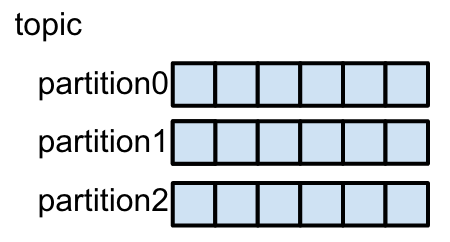
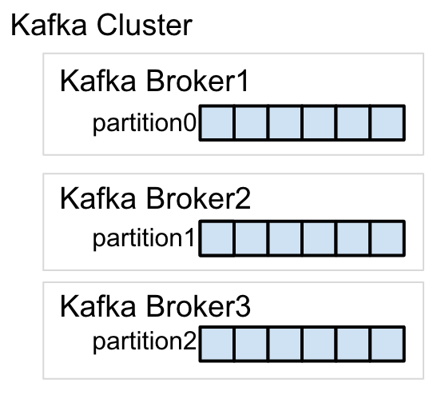
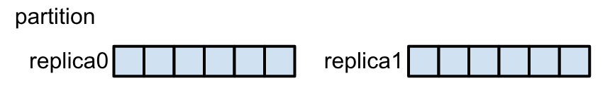
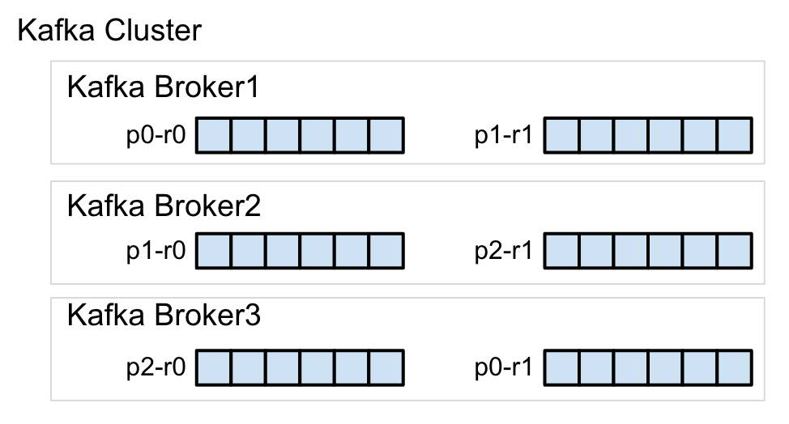

# Hands-On With Kafka

Zach Cox | [@zcox](https://twitter.com/zcox) | http://theza.ch

[Banno](https://banno.com) | [Jack Henry & Associates](https://www.jackhenry.com)

[Iowa Code Camp Spring 2015](http://iowacodecamp.com)

## Worth Reading

- [Kafka docs](http://kafka.apache.org/documentation.html)
- [I ♡ Logs](http://shop.oreilly.com/product/0636920034339.do)
- [Confluent Platform](http://confluent.io/product/)
- [Confluent Platform docs](http://confluent.io/docs/current/index.html)
- http://blog.confluent.io/2015/02/25/stream-data-platform-1/
- http://blog.confluent.io/2015/02/25/stream-data-platform-2/

## Running Examples

To run all of the infrastructure:

```
docker-compose up -d
```

To run one of the code examples:

```
./sbt run
```

To kill the infrastructure:

```
docker-compose kill && docker-compose rm --force
```

## Basic Kafka: Producers and Consumers


- producer sends messages to kafka topic
- consumer receives messages from kafka topic
- messages in topic
  - ordered
  - persistent
  - each message has an offset
- consumer remembers offset of last received message
- consumer can start receiving messages from any offset
- each message sent to one consumer in same group

## Running Kafka

- examine docker-compose.yml
- Zookeeper
- Kafka cluster = multiple Kafka brokers

## Serialization/Deserialization

- Kafka only knows bytes: `ProducerRecord[Array[Byte], Array[Byte]]`
- Best practice: [Avro](http://avro.apache.org/) + [Schema Registry](http://confluent.io/docs/current/schema-registry/docs/intro.html)

To view Avro schema in Registry: `curl http://192.168.59.103:8081/subjects/basic2-value/versions/1`

## Partitions

- topic split into 1 or more partitions
- partition is unit of parallelism and allows scale
- messages ordered within partition
- message key determines partition
- messages in partition go to same consumer


***


***


***


***


***


***


***


***


***



***



## Replicas

- each partition has 1 or more replicas
- replicas provide data replication (duh)
- producer sends messages to leader replica
- follower replicas consume from leader replica
- tunable consistency



***



## Example: Application Events

## Example: Logging

## Example: Change Data Capture

- http://blog.confluent.io/2015/04/23/bottled-water-real-time-integration-of-postgresql-and-kafka/

## Fault Tolerance

- broker stops
- broker dies
- broker loses data

## Performance Testing

- http://engineering.linkedin.com/kafka/benchmarking-apache-kafka-2-million-writes-second-three-cheap-machines
